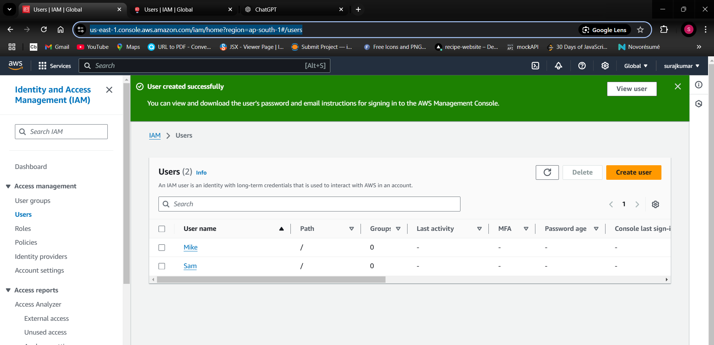
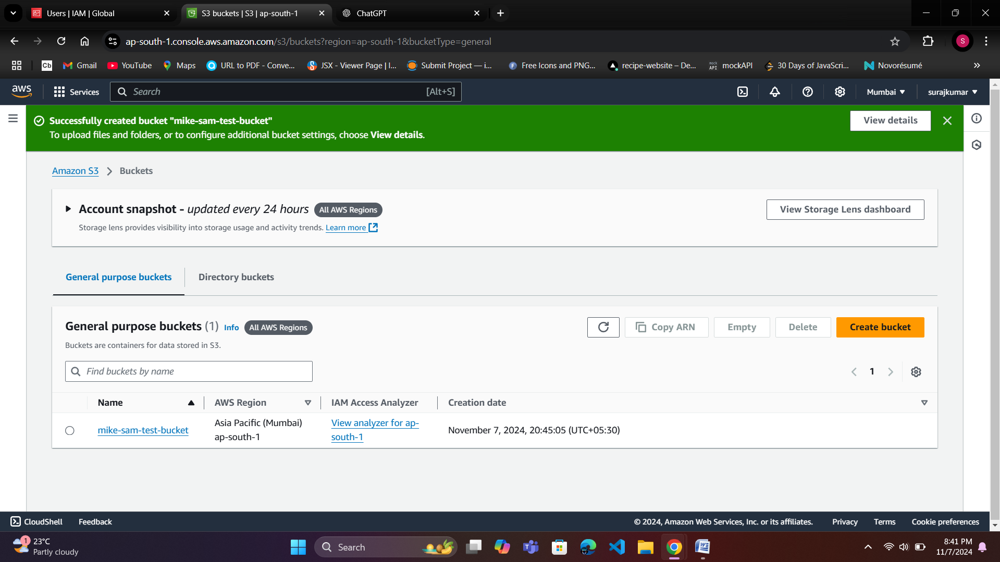
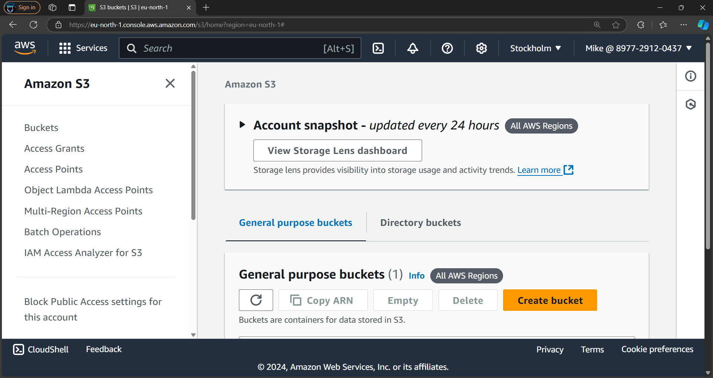
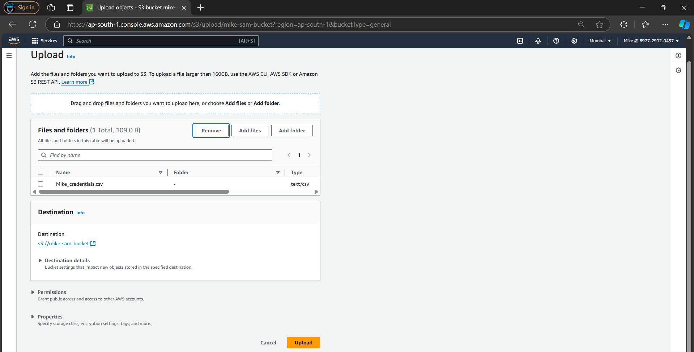
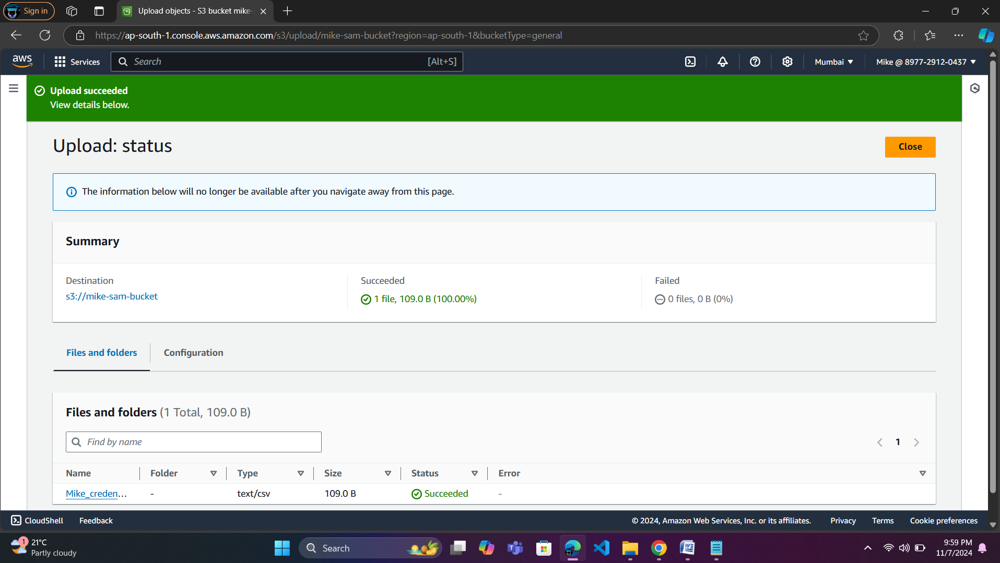
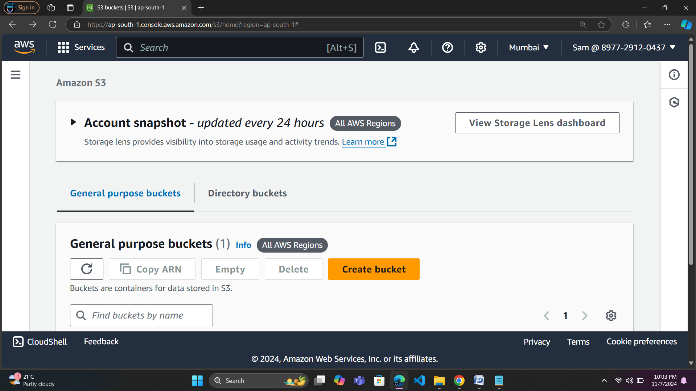
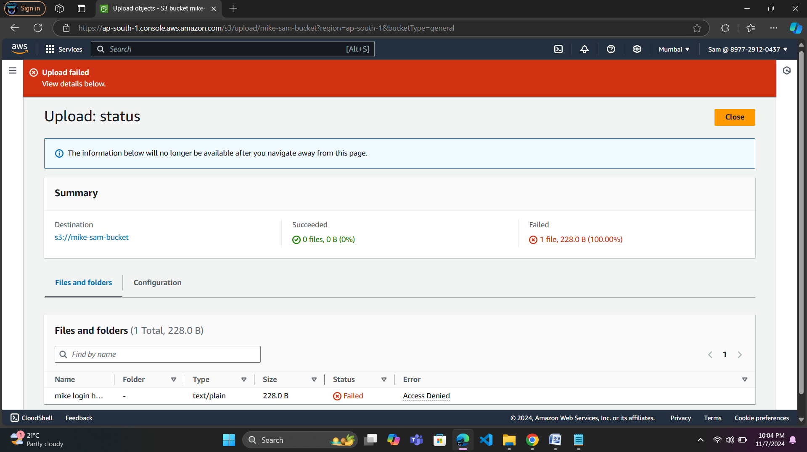
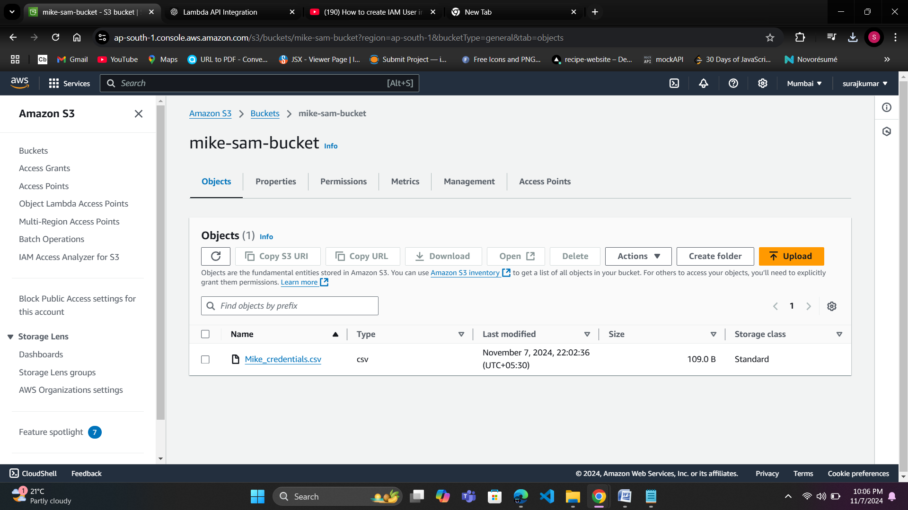

# IAM USER CREATION  and S3 ACCESS MANAGEMENT in AWS

#### This assignment demonstrates a practical use case for managing AWS IAM users with different access levels to an S3 bucket, which enhances security and control over data. By assigning Full Access to Mike and Read-Only Access to Sam, it ensures that sensitive data can be uploaded and modified by authorized users while restricting others to only view and download the content. This approach allows organizations to enforce granular permissions, improve data security, and reduce the risk of unauthorized changes, all while simplifying user management in the cloud.

 

## Here are the steps  you can follow  to implement this  assignment:

### Step 1: Create IAM Users

#### 1. Create User Mike (S3 Full Access):
- Go to IAM Console.
- Click Users on the left sidebar and then Add user.
- Username: Mike.
-Access Type: Select Programmatic access and AWS Management Console access (optional).
- To set a password: Choose Auto-generated password or set a custom password.
- If setting a custom password, ensure the "User must create a new password at next sign-in" box is selected (recommended).
- In the Permissions section, select AmazonS3FullAccess.
- Click Next: Tags, then Next: Review, and finally Create user.
- Save the credentials for Mike.

#### 2. Create User Sam (S3 Read-Only Access):

- Go to IAM Console > Users > Add user.
- Username: Sam
- Access Type: Select Programmatic access and AWS Management Console access (optional).
- Set a password similarly as described for Mike.
- In the Permissions section, select AmazonS3ReadOnlyAccess.
- Click Next: Tags, then Next: Review, and finally Create user.
- Save the credentials for Sam.

### Step 2: Create an S3 Bucket
- Create S3 Bucket:
- Go to the S3 Console.
- Click Create bucket.
- Set a unique bucket name (e.g., mike-sam-test-bucket-12345).
- Choose a region (e.g., us-east-1).
- Leave other settings as default and click Create bucket.

### Step 3: Test Access for Mike (S3 Full Access)
- Login as Mike:
- Use the login URL for Mike (from the .csv file).
- Check Bucket Access:
- Once logged in, navigate to the S3 Console.
- Verify Mike can see and access the bucket mike-sam-test-bucket-12345.
- Mike should be able to upload files to the bucket since he has full S3 access.

### Step 4: Test Access for Sam (S3 Read-Only Access)
- Login as Sam:
- Use the login URL for Sam (from the .csv file).
- Check Bucket Access:
- Once logged in, navigate to the S3 Console.
- Verify Sam can see and access the bucket mike-sam-test-bucket-12345.
- Sam can view and download files, but will not see the Upload button and cannot upload files due to read-only permissions.

### Step 5: Verify Permissions
- Mike (Full Access) can upload, delete, and view files in the bucket.
- Sam (Read-Only) can only view and download files, but cannot upload files.

### Step 6: Clean Up (Optional)
Delete the S3 Bucket if no longer needed.
Delete IAM Users (Mike and Sam):
Go to the IAM Console, select the users (Mike and Sam), and delete them.

## Summary:
- Mike can upload files (Full Access).
- Sam can only view and download files (Read-Only).

- *The user can only access the services and resources for which permissions have been granted.*
- *In this example, the user has access to only  S3  but not to EC2, Lambda or other services unless explicitly allowed.*

 
 

# --------------------Screenshots-----------------------------------

1. *Mike and sam user are created.*

 
 

2. *S3 (Simple Storage Service)  Bucket is created.*

 
 

3. *Login as mike user using there credintials.*

 
 

4.* Files uploded to the S3 Bucket by mike user. As he have full access of S3 Bucket.*

 
 

5. *Files uploded to the S3 Bucket Successfully by mike*

 
 

6. *Now Login as sam user using there credentials.*

 
 

7. *sam user Trying to uplod file in the S3 bucket but unable to uplod because sam  have read only permission of S3 Bucket.*

 
 

8. *S3 Bucket of only file which are uploded by mike user.*

 
 
 
 

**👨‍💻 𝓒𝓻𝓪𝓯𝓽𝓮𝓭 𝓫𝔂**: [Suraj Kumar Choudhary](https://github.com/Surajkumar4-source) | 📩 **𝓕𝓮𝓮𝓵 𝓯𝓻𝓮𝓮 𝓽𝓸 𝓓𝓜 𝓯𝓸𝓻 𝓪𝓷𝔂 𝓱𝓮𝓵𝓹**: [csuraj982@gmail.com](mailto:csuraj982@gmail.com)

 
